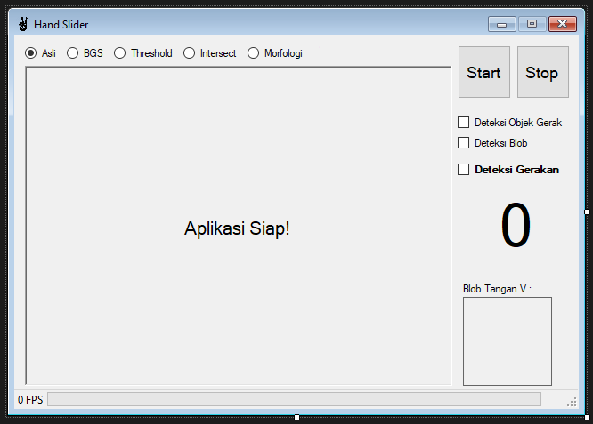

# HandSlider
**Slideshow Powerpoint Navigation With Hand Movement Using Hidden Markov Model Method**

*`Kendali Navigasi Slideshow Powerpoint Dengan Gerakan Tangan Menggunakan Metode Hidden Markov Model`*

## Pre-Processing Methods
 - Background Subtraction
   > Elsayed, R. A., Sayed, M. S., & Abdalla, M. I. (2016). Skin-based adaptive background subtraction for hand gesture segmentation. Proceedings of the IEEE International Conference on Electronics, Circuits, and Systems, 2016-March, 33–36. https://doi.org/10.1109/ICECS.2015.7440242
 - Threshold YCbCr
   > Santa, U., Tazreen, F., & Chowdhury, S. A. (2018). Bangladeshi hand sign language recognition from video. 20th International Conference of Computer and Information Technology, ICCIT 2017, 2018-Janua, 1–4. https://doi.org/10.1109/ICCITECHN.2017.8281818
 - Morphology
   > Kakkoth, S. S., & Gharge, S. (2018). Visual Descriptors Based Real Time Hand Gesture Recognition. 2018 International Conference On Advances in Communication and Computing Technology, ICACCT 2018, 361–367. https://doi.org/10.1109/ICACCT.2018.8529663

## Classification Method
 - Hidden Markov Model
   > Pisharady, P. K., & Saerbeck, M. (2015). Recent methods and databases in vision-based hand gesture recognition: A review. Computer Vision and Image Understanding, 141, 152–165. https://doi.org/10.1016/j.cviu.2015.08.004
   
   > Anuj, A., Mallick, T., Das, P. P., & Majumdar, A. K. (2016). Robust control of applications by hand-gestures. 2015 5th National Conference on Computer Vision, Pattern Recognition, Image Processing and Graphics, NCVPRIPG 2015. https://doi.org/10.1109/NCVPRIPG.2015.7490031
   
   > Eugine Kang. (2017, September 1). Hidden Markov Model - Eugine Kang - Medium. https://medium.com/@kangeugine/hidden-markov-model-7681c22f5b9
   
   > Setiyoaji, A., Muflikhah, L., & Fauzi, M. A. (2017). Named Entity Recognition Menggunakan Hidden Markov Model dan Algoritma Viterbi pada Teks Tanaman Obat. Jurnal Pengembangan Teknologi Informasi Dan Ilmu Komputer, 1(12), 1858–1864. http://j-ptiik.ub.ac.id/index.php/j-ptiik/article/view/673
   
   > Firdaniza, Gusriani, N., & Akmal. (2006). Hidden Markov Model.

## Dataset
 - Cambridge Hand Gesture Dataset : https://labicvl.github.io/ges_db.htm
   > Kim, T. K., Wong, S. F., & Cipolla, R. (2007). Tensor canonical correlation analysis for action classification. Proceedings of the IEEE Computer Society Conference on Computer Vision and Pattern Recognition. https://doi.org/10.1109/CVPR.2007.383137

## Movements
 - **Left (only Right Hand) > Next Slide** *`Kiri (hanya Tangan Kanan) > Slide Selanjutnya`*
 
 - **Right (only Left Hand) > Previous Slide** *`Kanan (hanya Tangan Kiri) > Slide Sebelumnya`*
 
 - **Down > Last Slide** *`Bawah > Slide Akhir`*
 
 - **Up > First Slide** *`Atas > Slide Awal`*
 
